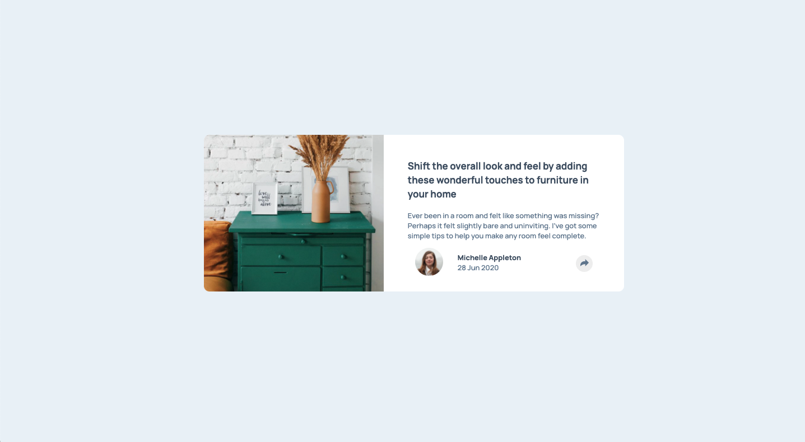
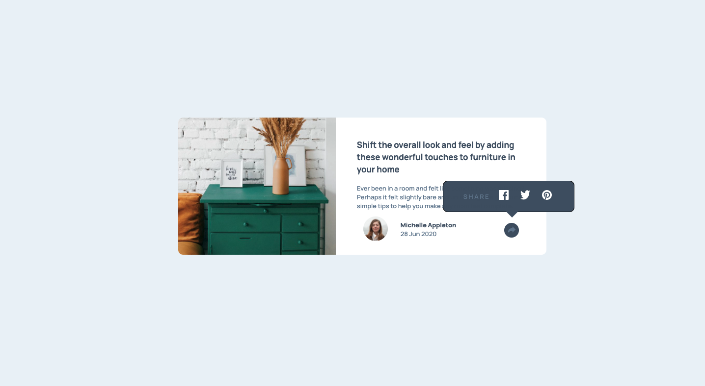
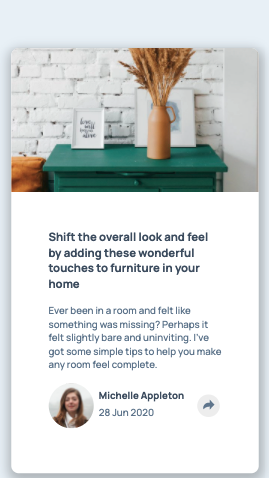
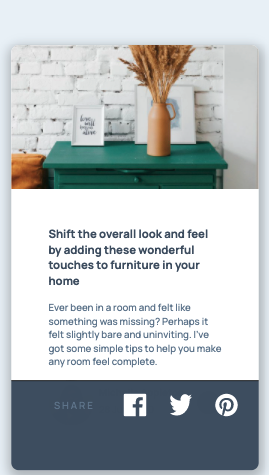

# Frontend Mentor - Article preview component solution

This is a solution to the [Article preview component challenge on Frontend Mentor](https://www.frontendmentor.io/challenges/article-preview-component-dYBN_pYFT). Frontend Mentor challenges help you improve your coding skills by building realistic projects. 

## Table of contents

- [Overview](#overview)
  - [The challenge](#the-challenge)
  - [Screenshot](#screenshot)
  - [Links](#links)
- [My process](#my-process)
  - [Built with](#built-with)
  - [What I learned](#what-i-learned)
  - [Continued development](#continued-development)
  - [Useful resources](#useful-resources)
- [Author](#author)
- [Acknowledgments](#acknowledgments)

## Overview

### The challenge

Users should be able to:

- View the optimal layout for the component depending on their device's screen size
- See the social media share links when they click the share icon

### Screenshot






### Links

- Solution URL: [Add solution URL here](https://gelatodigital.com/portfolio)
- Live Site URL: [Add live site URL here](https://your-live-site-url.com)

## My process

### Built with

- Semantic HTML5 markup
- CSS custom properties
- CSS Grid
- Mobile-first workflow
- JQuery

### What I learned

This challenge first taught me once again how to add jQuery. I know it sounds dumb, but it is always humbling to take 45mins reading documentation, to copy one line of code, and only than be allowed to start the project 
```html
<script src='http://ajax.aspnetcdn.com/ajax/jQuery/jquery-3.2.1.js'></script>
```
This project also uses a super helpful resource for animations. One simple link and one simple line and you have hundreds of animations to play around with
```html
  <link
    rel="stylesheet"
    href="https://cdnjs.cloudflare.com/ajax/libs/animate.css/4.1.1/animate.min.css"
  />
```
```css
transition: animate__fadeIn;
```
The way to toggle tool tips using jquery isn't as clean as simply using css, but it is super elegant. The idea of stopPropagation will probably come in handy in the future.
```js
$('html').click(function() {
    $('#subscribe-pop').hide();
 })

 $('#footleft').click(function(e){
     e.stopPropagation();
 });

$('#link').click(function(e) {
 $('#subscribe-pop').toggle();
 });
```


### Continued development

I should have used svg better. I ended up simply using img tag and that sopped me from being able to change the svg color once the icon was clicked. In the future, svg should become part of my tool-box, but for now it is only something to use in case of necessity.

### Useful resources

-[query toggle](http://jsfiddle.net/4yBGt/)
-[query link](https://makitweb.com/embed-jquery-html-page/)
-[background image](https://www.w3schools.com/cssref/pr_background-position.asp)
-[background image position](https://stackoverflow.com/questions/8200204/fit-background-image-to-div)
-[shadow generator](https://html-css-js.com/css/generator/box-shadow/)
-[animation](https://animate.style/)
-[bottom arrow](https://www.w3schools.com/css/css_tooltip.asp)

## Author

- Website - [Rodrigo Piedade](https://www.gelatodigital.com)
- Frontend Mentor - [@Rod-Barbosa](https://www.frontendmentor.io/profile/Rod-Barbosa)

## Acknowledgments

Thanks again to my Jedi mester for showing me the animations library. This solved a 2hs problem in 5 mins.